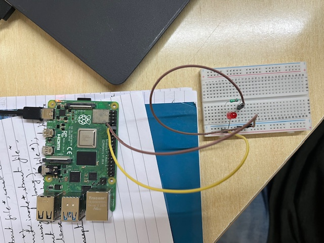
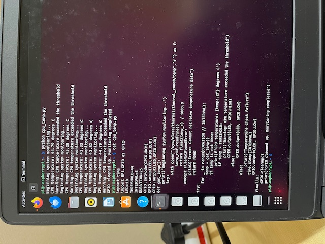

# Basic GPIO Tasks For Raspberry Pi

This document records the concepts used for the basic GPIO tasks performed with Raspberry Pi 4B.

The three main objectives included-
1. Simple LED blinking.
2. Monitoring CPU temperature.
3. Adjusting LED brightness using PUlse Width Modulation (PWM).
(The .py files of these tasks are shared alondside this doc.)

## Prerequisites
- To run the programs, we require python to be installed using `sudo apt install python3 python3-pip python3-dev python3-venv build-essentials`
- In each python program, import the following libraries-
  * RPi.GPIO, to interface with the Raspberry Pi board's GPIO pins.
  * time, to implement delays when required.
- For the LED programs, we require the following components
  * A small breadboard.
  * One small LED.
  * A few M-F connecting wires.
  * A 220 kilo-Ohm resistor.
- The circuit connected as seen in this image-

 

## 1. Simple LED blinking
Using the libraries above, we can simply set a chosen GPIO pin for our LED triggering output, and set it's output value to change after a short delay period, causing the LED to blink at regular intervals.

## 2. CPU Temperature Monitor
Here, wee use the sys class's thermal zones to pull CPU temperature in real time and check it against a set threshold at regular intervals. If the temperature is over the threshold, a warning is displayed. The checking happens as follows-

## 3. LED With PWM
We induce a fading effect i.e. adjust the brightness of the LED using the concept of Pulse Width Modulation. By adjusting the duty cycle, we can adjust the power given to the LED, and thus affect the intensity of the light it produces.
