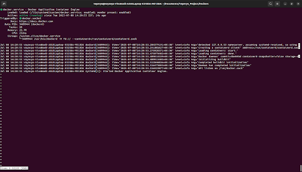
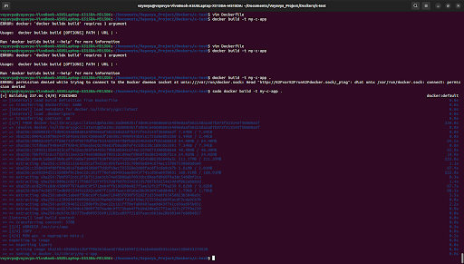
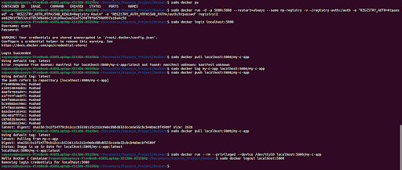
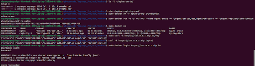

# Docker Usage For Version Control
Docker is a valuable containerization tool that offers a level of abstraction over the host system and lest less computationally intensive than virtual machines. It can even run in parallel with virtual machines.

This guide covers the setup of Docker for use on an Ubuntu system, running a simple hello world program, and creating a local server to store our code.


## Docker Setup

### Step 1: Uninstall old versions
```bash
sudo apt-get remove docker docker-engine docker.io containerd runc
```

### Step 2: Install dependencies
```bash
sudo apt-get update
sudo apt-get install ca-certificates curl gnupg lsb-release
```

### Step 3: Add the official GPG key
```bash
sudo mkdir -p /etc/apt keyrings
curl -fsSL https://download.docker.com/linux/ubuntu/gpg | sudo gpg --dearmor -o /etc/apt/keyrings/docker.gpg
```

### Step 4: Setup a stable Docker repository
```bash
echo "deb [arch=$(dpkg --print-architecture) signed-by=/etc/apt/keyrings/docker.gpg] https://download.docker.com/linux/ubuntu $(lsb_release -cs) stable" | sudo tee /etc/apt/sources.list.d/docker.list > /dev/null
```

### Step 5: Install the Docker engine
```bash
sudo apt-get update
sudo apt-get install docker-ce docker-ce-cli containerd.io docker-buildx-plugin docker-compose-plugin
```

### Step 6: Verify that Docker runs
```bash
sudo systemctl status docker
```
You should see an output like this . To return to the command line, press Ctrl+C.

### Step 7: Set user to run docker without sudo (optional)
```bash
sudo usermod -aG docker $USER
newgrp docker
```
Here, `USER` is the name of the user you wish to grant access.


## Run A C Program Using Docker Containers

### Step 1: Create a project directory
```bash
mkdir c-test && cd c-test
```

### Step 2: Add your C file
Run `vim main.c` then type in this code-

```c
#include <stdio.h>
int main() {
	printf("Hello Docker C Container!");
	return 0;
}
```

### Step 3: Create a Dockerfile
Run `vim Dockerfile` then type in-

```Dockerfile
#Use official gcc image
FROM gcc:latest
#Set work directory
WORKDIR /usr/src/app
COPY . .
# Compile the C file
RUN gcc -o myprogram main.c
#Run the compiled binary
CMD ["./myprogram"]
```

### Step 4: Build the Docker image
This may take some extra time depending on your system

```bash
sudo docker build -t my-c-app .
```
You should see this . Wait until all processes are completed

### Step 5: Run the Docker container
```bash
sudo docker run --rm my-c-app
```

You should see `Hello Docker C Container!` printed.


## Creating A Private Server To Store And Run Code

### Step 1: Start your local registry
```bash
sudo docker run -d -p 5000:5000 --name my-registry registry:2
```
This starts a local registry at localhost:5000. An example for our purposes.

### Step 2: Tag your code's image
```bash
sudo docker tag my-c-app localhost:5000/my-c-app
```
We used the image name for our test program as built earlier.

### Step 3: Push to registry
```bash
sudo docker push localhost:5000/my-c-app
```

### Step 4: Pull the image from the registry
```bash
sudo docker pull localhost:5000/my-c-app
```

### Step 5: Run your code's image
```bash
sudo docker run --rm --privileged --device /dev/ttyS0 localhost:5000/my-c-app
```
#### Note: We practice the use of `--privileged` and `--device` as they're required for testing kernel modules and device drivers in industrial projects.

The output should be similar to the base case after the pull .


## Add Password Protection

### Step 1: Install htpassword from apache2-utils
```bash
sudo apt-get update
sudo apt-get install apache2-utils
```

### Step 2: Create a password file with a new user 
Choose your project or home directory for this process

```bash
mkdir -p ~/registry-auth
htpassword -Bc ~/registry-auth/htpasswd username
```
* Replace username with your desired username. 
* Use -c only when creating a new file, it isn't required when adding a user to an existing file. 
* -B uses bcrypt to securely hash your password.
* Once these commands are run, you will be prompted to enter your desired password.

### Step 3: Run your Docker registry with this authentication
```bash
sudo docker run -d -p 5000:5000 --restart=always --name my-registry -v ~/registry-auth:/auth -e "REGISTRY_AUTH=htpasswd" -e "REGISTRY_AUTH_HTPASSWD_REALM=Registry Realm" -e "REGISTRY_AUTH_HTPASSWD_PATH=/auth/htpasswd" registry:2
```
* The maps the auth directory to the requisite registry and enables the password setup.
* The realm line, while not strictly required is good in team settings as it keeps track of the users logging in, and distinguishes between registries in complex environments. 

### Step 4: Login to your registry
Your registry should now require password authentication to push or pull images.

```bash 
sudo login localhost:5000
```
You will then be prompted to enter the username and password from step 2. If the login works, you can perform your tag, push, and pull operations. Docker will remember your successful login.

### Step 5: Logout
Once your tasks are complete, you can logout of the registry using this command-

```bash
sudo docker logout localhost:5000
```

One can expect the following prompts on screen, assuming we have defined our username and password earlier as described above- 


## Enabling HTTPS For Improved Security During Remote Access
Now, we can use our existing password file for authentication and enable HTTPS using NGINX to expose the registry securely and have Docker trust the self-signed cert locally.

### Step 1: Generate your self-signed certificate
```bash
mkdir -p ~/nginx-certs
openssl req -newkey rsa:4096 -nodes -sha256 -keyout ~/nginx-certs/domain.key -x509 -days 365 -out ~/nginx-certs/domain.crt -subj "/CN=127.0.0.1.nip.io"
```
* `req` starts a new certificate request.
* `-newkey rsa:4096` creates a new 4096-bit RSA private key.
* `-sha256` uses the SHA-256 signature algorithm.
* `-x509` generates a self-signed certificate.
* `keyout domain.key` saves the private key to `domain.key`.
* `-nodes` ensures that we do not encrypt the private key with a passphrase so it can be automatically used.
* `-days 365` sets the validity period for the certificate. Here it is one year.
* `-out domain.crt` saves the certificate to `domain.crt`.
* `-subj "/CN=127.0.0.1.nip.io"` sets the sertificate's common name (CN) to match the host name to be used in HTTPS requests.
* 127.0.0.1.nip.io is used to act as a real domain to test the HTTPS fucntionality locally with a proper host name.

### Step 2: Run the Docker registry
Using our existing password file in `~/registry-auth/htpasswd`-

```bash
sudo docker rm -f my-registry 2>/dev/null
sudo docker run -d -p 5000:5000 --restart=always --name my-registry -v ~/registry-auth:/auth -e REGISTRY_AUTH=htpasswd -e REGISTRY_AUTH_HTPASSWD_REALM="MyLocalRegistry" -e REGISTRY_AUTH_HTPASSWD_PATH=/auth/htpasswd registry:2
```

### Step 3: Create your NGINX config file
First run `vim ~/nginx-registry.conf` then paste this-

```nginx
events {}
http {
	upstream docker-registry {
		server 172.17.0.1:5000;
	}
	server {
		listen 443 ssl;
		server_name 127.0.0.1.nip.io;
		ssl_certificate /etc/nginx/certs/domain.crt;
		ssl_certificate_key /etc/nginx/certs/domain.key;
		location /v2/ {
			proxy_pass http://docker-registry;
			proxy_set_header Host $host;
			proxy_set_header X-Real-IP $remote_addr;
			proxy_set_header X-Forwarded-For $proxy_add_x_forwarded_for;
			proxy_set_header X-Forwarded-Proto $scheme;
			proxy_read_timeout 900;
		}
	}
}
```
Save and exit.

### Step 4: Run NGINX as a Docker container
```bash
sudo docker rm -f nginx-proxy 2>/dev/null
sudo docker run -d -p 443:443 --name nginx-proxy -v ~/nginx-certs:/etc/nginx/certs:ro -v ~/nginx-registry.conf:/etc/nginx/nginx.conf:ro nginx
```
* `-p 443:443` maps the host HTTPS port to the containers HTTPS port.
* The two `-v` prefixed commands mount your certs and config files in read-only mode.
* `nginx` ensures that you use the latest official NGINX image from the Docker Hub.

### Step 5: Test HTTPS access
```bash
curl -k https://127.0.0.1.nip.io/v2/
```
- The -k skips cert verification to speed up testing.

You can now login using you username and password-

```bash
sudo docker login https://127.0.0.1.nip.io
```

### Step 6: Trust the self-signed certificate
Create the trust path-

```bash
sudo mkdir -p /etc/docker/certs.d/127.0.0.1.nip.io
sudo cp ~/nginx-certs/domain.crt /etc/docker/certs.d/127.0.0.1.nip.io/ca.crt
```

Then restart Docker with `sudo systemctl restart docker`

Now, you should be able to perform push and pull operations on your registry.

### Step 7: To stop everything once tasks are completed
```bash
sudo docker rm -f nginx-proxy my-registry
```

Your setup and outputs should resemble this .


