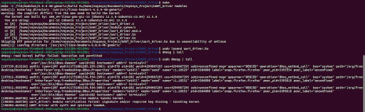
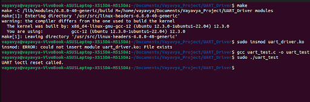

# UART Driver for Rapberry Pi

This file aims to document the creation and augmentation of a simple UART device driver for the Raspberry Pi model 4B.

## Equipment Prerequisites

* A Linux system (preferably Ubuntu/Debian).
* A Raspberry Pi 4B board.
* A micro SD card (8GB+ storage).
* A micro SD card reader.
* A USB to GPIO adapter.
* 6 F-F wires.

## UART Background
UART is enabled on the Raspberry Pi's GPIO pins, making it a prefered way to interface with other devices or access boot messages via the serial console. UART (Universal Asynchronous Receiver/Transmitter) is an essential hardware component for serial communication. It enables the exchange of data bit by bit over a link. It is simple and versatile, making it a popular choice for applications including debugging and establishing connections with other embedded systems.
It's major benefits include:
1. Serial Communication: UART allows for serial data transmission, where data bits are sent one after another, unlike parallel communication which transmits multiple bits simultaneously. 
2. Asynchronous Communication: UART is asynchronous, meaning it doesn't rely on a shared clock signal to synchronize data transfer. This simplifies it's hardware requirements. 
3. Bidirectional Communication: UART supports full-duplex communication, meaning data can be transmitted and received at the same time. 
4. Configurable Data Format: UART allows for configuration of data bits, stop bits, and parity bits. 
5. Simple Hardware Implementation: Compared to other serial communication protocols like SPI, UART is easier to implement and use. 
6. Debugging Interface: UART can be used as a debugging interface in embedded systems. By connecting a UART cable to a computer, developers can send diagnostic messages, log output, and monitor system states. 
7. Connecting to other Devices: UART is often used to connect the Raspberry Pi with other devices like GPS modules, Bluetooth modules, and so on. 

## Notable Protocols
In addition to UART implementation, we are also adding 3 additional protocols to improve the quality and novelty of our driver.
1. IOCTL- Input/output control is a system call used in device drivers to handle device-specific operations that are not manageable through standard file operations. It allows user-mode applications to send commands to drivers for configuration, control, and so on.
2. Sysfs- It provides a way for drivers to export device attributes and control device behavior through virtual files, enabling apps to monitor and modify devices.
3. Spinlock- It is a very simple single-holder lock. If a process attempts to acquire a spinlock and it is unavailable, the process will keep trying (spinning) until it can acquire the lock. 

## Driver Code 
Here I'm including the driver code I used with comments to explain it's logic and necessity.

```c
//Including necessary headers
# include <linux/module.h>   
# include <linux/init.h>
# include <linux/fs.h>       //For file operations
# include <linux/uaccess.h>  //For safe access to user space
# include <linux/cdev.h>     //For character device structure
# include <linux/io.h>       //For memory mapped input and output
# include <linux/spinlock.h> //For concurrency protection
# include <linux/device.h>   //For sysfs device interface
# include <linux/ioctl.h>    //For control interface

//Defining macros for later use
//Notably device and class names, UART base address, and ioctl command macros
#define DEVICE_NAME "uart_driver"
#define CLASS_NAME "uart_class"
#define UART_BASE 0xFE201000             //UART0 base address on RPi
#define UART_SIZE 0X48                   //Size of PL011 UART memory region
#define IOCTL_M 'u'                      //Unique namespace for ioctl
#define UART_IOCTL_RESET _IO(IOCTL_M, 0) //No data transfer just read, write

//Global variables
static void __iomem *uart_base;             //UART memory pointer
static int major;                           //Device major number
static struct class *uart_class;
static struct cdev uart_cdev;
static struct device *uart_device;          //Actual device created 
static spinlock_t uart_lock;                //Spinlock
static char last_msg[100] = "No messages."; //Required for troubleshooting with logs

//File Operations
//Read
static ssize_t uart_read(struct file *file, char __user *buf, size_t len, loff_t *off) {
	char ch;
	unsigned long flags;
	printk(KERN_ALERT "uart_read(): Attempting to acquire spinlock by PID: %d\n", current->pid);
	spin_lock_irqsave(&uart_lock, flags);
	printk(KERN_ALERT "uart_read(): Acquired spinlock by PID: %d\n", current->pid);
	while(!(readl(uart_base + 0x18) & 0x10))    //Offsets in the UART flag register to inform the system to wait as bit 4 isn't 0 i.e. there is data present
		cpu_relax();
	ch = readl(uart_base + 0x00) & 0xFF;       //Reading byte 
	spin_unlock_irqrestore(&uart_lock, flags); //Releasing the lock
	printk(KERN_ALERT "uart_read(): Released spinlock by PID: %d\n", current->pid);
	if (copy_to_user(buf, &ch, 1))
		return -EFAULT;
	snprintf(last_msg, sizeof(last_msg), "Read char: %c", ch);
	return 1;
}
	
//Write
static ssize_t uart_write(struct file *file, const char __user *buf, size_t len, loff_t *off) {
	char ch;
	unsigned long flags;
	if (copy_from_user(&ch, buf, 1))
		return -EFAULT;
	printk(KERN_ALERT "uart_write(): Attempting to acquire spinlock by PID: %d\n", current->pid);
	spin_lock_irqsave(&uart_lock, flags);
	printk(KERN_ALERT "uart_write(): Acquired spinlock by PID: %d\n", current->pid);
	while (readl(uart_base + 0x18) & 0x20) //UART flag register bit 5 to set spinlock
		cpu_relax();
	writel(ch, uart_base + 0x00);
	spin_unlock_irqrestore(&uart_lock, flags);
	printk(KERN_ALERT "uart_write(): Attempting to acquire spinlock by PID: %d\n", current->pid);
	snprintf(last_msg, sizeof(last_msg), "Wrote char: %c", ch);
	return 1;
}

//To handle IOCTL calls 
static long uart_ioctl(struct file *file, unsigned int cmd, unsigned long arg) {
	switch (cmd) {
		case UART_IOCTL_RESET:
			writel(0, uart_base + 0x30);                                  //Since 0x30 is the offset of the control register CR as per the BCM processor datasheet
			writel(0x301, uart_base + 0x30);                              //0x301 enables UART, TX, and RX which is 0b1100000001 and bits 0, 8 and 9 determine these features
			snprintf(last_msg, sizeof(last_msg), "UART reset performed.");
			break;
		default:
			return -EINVAL;
	}
	return 0;
}

//Open
static int uart_open(struct inode *inode, struct file *file) {
	return 0;
}

//Release
static int uart_release(struct inode *inode, struct file *file) {
	return 0;
}

//File Ops structure
static struct file_operations uart_fops = {
	.owner = THIS_MODULE,
	.read = uart_read,
	.write = uart_write,
	.unlocked_ioctl = uart_ioctl,
	.open = uart_open,
	.release = uart_release,
};

//Sysfs log
//Defines how we display the content of the sys log
static ssize_t log_show(struct device *dev, struct device_attribute *attr, char *buf) {
	return snprintf(buf, PAGE_SIZE, "%s\n", last_msg);
}
static DEVICE_ATTR_RO(log); //Generates a struct device attribute named log with .show() access

//Module init
static int __init uart_init(void) {
	dev_t dev;
	if (alloc_chrdev_region(&dev, 0, 1, DEVICE_NAME) < 0)                  //Allocates the character device major number
		return -1;
	major = MAJOR(dev);                                                    //Registers the character device
	cdev_init(&uart_cdev, &uart_fops);
	if (cdev_add(&uart_cdev, dev, 1) < 0)
		return -1;
	uart_class = class_create(CLASS_NAME);                    //Creates the device node in the dev directory
	if (IS_ERR(uart_class))
		return PTR_ERR(uart_class);      
	uart_device = device_create(uart_class, NULL, dev, NULL, DEVICE_NAME); //Create the log file 
	if (IS_ERR(uart_device)) 
		return PTR_ERR(uart_device);               
	if (device_create_file(uart_device, &dev_attr_log)) {
		printk(KERN_ERR "Failed to create sysfs log attribute.\n");
		return -1;
	}
	uart_base = ioremap(UART_BASE, UART_SIZE);                             //Maps UART registers
	if (!uart_base)
		return -ENOMEM;
	spin_lock_init(&uart_lock);
	writel(0, uart_base + 0x30);                                           //Disable UART
       	writel(0x301, uart_base + 0x30);                                       //Enable UART, TX and RX
       	printk(KERN_INFO "UART driver with sysfs and spinlock loaded.\n");
       	return 0;
}

//Module Exit
//Unmaps memory, destroys sysfs log, and frees resources after completion
static void __exit uart_exit(void) {
	device_remove_file(uart_device, &dev_attr_log);
	device_destroy(uart_class, MKDEV(major, 0));
	class_destroy(uart_class);
	cdev_del(&uart_cdev);
	unregister_chrdev_region(MKDEV(major, 0), 1);
	iounmap(uart_base);
	printk(KERN_INFO "UART driver unloaded.\n");
}

//Key module calls
module_init(uart_init);
module_exit(uart_exit);

//Metadata
MODULE_LICENSE("GPL");
MODULE_AUTHOR("Mihiran Chakraborty");
MODULE_DESCRIPTION("UART driver with ioctl, sysfs, and spinlock.");
```


## Makefiles
Basic makefile-

```make
PWD := $(shell pwd)
obj-m += uart_driver.o
ccflags-y := -Wno-error
all:
	make -C /lib/modules/$(shell uname -r)/build M=$(PWD) modules
clean:
	make -C /lib/modules/$(shell uname -r)/build M=$(PWD) clean
```

Cross-compilation makefile-

```make
CROSS_COMPILE=aarch64-linux-gnu-KDIR=/path/to/rpi/linux-kernel-headers-or-source
PWD := $(shell pwd)
obj-m := uart_driver.o
all:
	$(MAKE) -C $(KDIR) ARCH=arm64 CROSS_COMPILE=$(CROSS_COMPILE) M=$(PWD) modules
clean:
	$(MAKE) -C $(KDIR) ARCH=arm64 CROSS_COMPILE=$(CROSS_COMPILE) M=$(PWD) clean
```


## Procedure For Driver Setup

### Step 1: Dependency Installation
For host system (Ubuntu)-
```bash
sudo apt update
sudo apt install aarch64-linux-gnu-gcc make libncurses-dev bc bison flex
```

For Raspberry Pi 4B running a 64-bit Linux kernel-
```bash
sudo apt install raspberrypi-kernel-headers
```


### Step 2: Enable UART On Raspberry Pi
In /boot/config.txt, edit to have `enable_uart=1`. Then run-
```bash
sudo reboot
```


### Step 3: Directory Setup
Create a directory called uartdriver, and store uart_driver.c, and Makefile as described above.
If this directory is on the Raspberry Pi, use the standard makefile. If it is on the Ubuntu host system use the cross-compilation makefile. In each case name the file 'Makefile'.

 
### Step 4: Build The Driver
Run while in the uartdriver directory-
```bash
make ARCH=arm64 CROSS_COMPILE=aarch64-linux-gnu- -C ../linux M=$(pwd) modules
```


### Step 5: Copy To Raspberry Pi
Run-
```bash
scp uart_driver.ko pi@<rpi-ip>:/home/pi/
```
Where rpi-ip is the ip address of your Raspberry Pi board. To obtain this, you must enable SSH on the board and ping it to find the ip and use it headless.


### Step 6: Use The Driver
Run-
```bash
ssh pi@<rpi-ip>
cd /home/pi/
sudo insmod uart_driver.ko
```


### Step 7: Verify Running
To check whether the requisite log messages appear, run-
```bash
ls /dev/uart_driver
ls /sys/class_uart_class/uart_driver/
cat /sys/class/uart_class/uart_driver/log
```


### Step 8: Cleanup
If verified successfully, unload the module from the kernel using-
```bash
sudo rmmod uart_driver
```


## Testing Procdure

### Testing IOCTL
We test this using a user space program on the Raspberry Pi-
```c
#include <fcntl.h>
#include <stdio.h>
#include <sys/ioctl.h>
#define UART_IOCTL_RESET _IO('u', 0)

int main() {
	int fd = open("/dev/uart_driver", O_RDWR);
	if (fd < 0) {
		perror("open");
		return 1;
	}
	if (ioctl(fd, UART_IOCTL_RESET) == -1) {
		perror("ioctl");
		return 1;
	}
	printf("UART ioctl reset called.\n)";
	return 0;
}
```

Save it as uart_test.c, compile and run it on the Raspberry Pi-
```bash
gcc uart_test.c -o uart_test
./uart_test
```

Verify output via sysfs log-
```bash
cat /sys/class/uart_class/uart_driver/log
```

Also check the kernel log-
```bash
dmesg | tail
```

You should see 'UART Reset performed'.


### Testing The Spinlock
There are two ways to verify the spinlock's presence:
1. Stress test-
Open two terminals. One runs a loop writing to the driver, and the other reads. Without the spinlock, we would get garbage characters.

2. Check logs using demsg-
```bash
dmesg | grep uart_read
dmesg | grep uart_write
```


### Testing UART Data I/O
1. Connect your host system using the USB-UART adapter, to the Raspberry Pi UART GPIO pins. (GPIO15-RX, GPIO14-TX, GPIO9-GND, GPIO2-5V)

2. On your host system, open a serial terminal and run-
```bash
sudo minicom -b 115200 -D /dev/ttyUSB0
```

3. On the Raspberry Pi, use the UART driver-
```bash
echo -n 'A' > /dev/uart_driver
```
We can also write a byte using the user space program. We should see the character sent on the host system terminal.

### Expected Output
If we simply add the makefile and c file, then run make and check for verity with `dmesg` we should see this output-


To verify our ioctl, we run the test program and the following output is seen-



